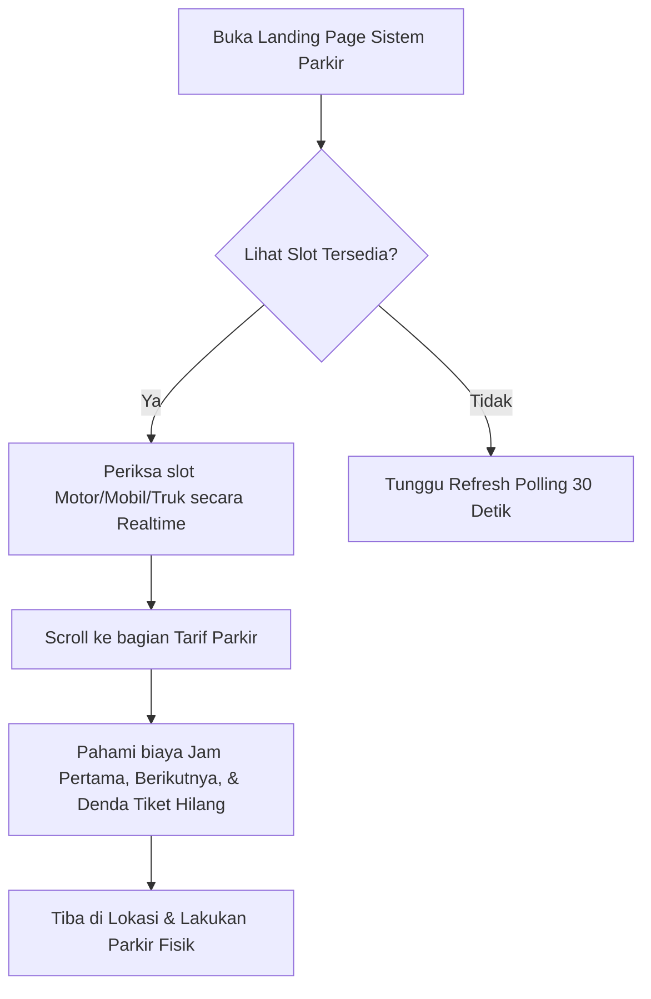
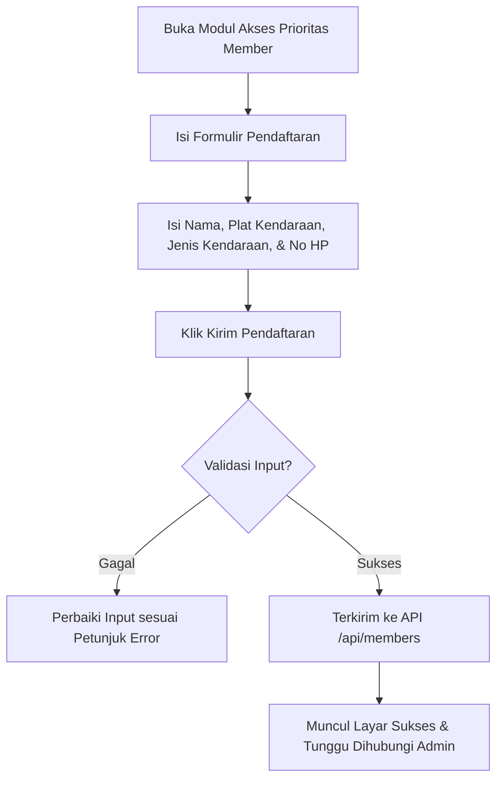
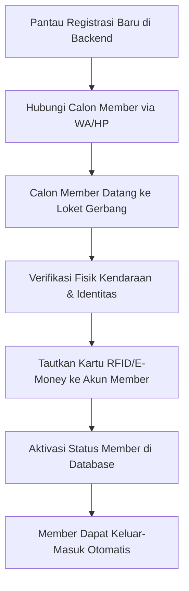
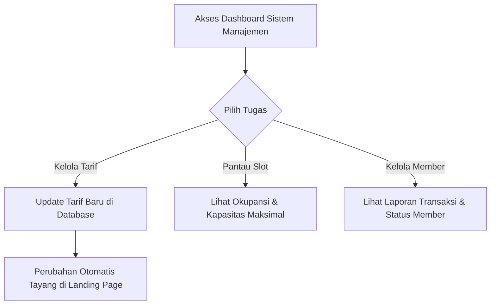

# Alur Kerja (Workflow) Sistem Parkir Berdasarkan Peran (Role)

Dokumen ini memetakan alur kerja pengguna dan sistem operasional parkir berdasarkan masing-masing peran (*role*). Pemahaman alur kerja ini berguna bagi tim pengembang maupun pengguna operasional dalam mengelola ekosistem parkir.

---

## 1. Pemetaan Peran (Role Mapping)
Sistem manajemen parkir ini membagi pengguna ke dalam 4 peran utama:
1. **Pengendara / Pengunjung Umum (Guest/Driver)**: Pengguna harian yang memerlukan informasi slot kosong dan tarif.
2. **Calon Member / Pendaftar (Member Applicant)**: Pengguna yang ingin meningkatkan akses mereka menjadi prioritas.
3. **Staf Admin Gerbang / Loket (Gate Administrator)**: Petugas gardu parkir yang memverifikasi dan mengaktifkan kartu member.
4. **Manajer Parkir / Admin Sistem (System/Parking Manager)**: Pengelola sistem keseluruhan yang mengatur konfigurasi operasional, tarif, dan pemantauan data.

---

## 2. Alur Kerja per Peran

### 1. Peran: Pengendara / Pengunjung Umum (Guest/Driver)
**Tujuan**: Mengetahui kondisi kapasitas parkir di lokasi tujuan dan biaya yang diperlukan secara transparan.

- **Langkah 1**: Pengendara mengakses landing page melalui peramban (smartphone/desktop).
- **Langkah 2**: Memantau modul **Ketersediaan Slot** (Motor, Mobil, Truk) yang diperbarui setiap 30 detik untuk memastikan ketersediaan tempat parkir sebelum berangkat/masuk.
- **Langkah 3**: Memeriksa modul **Tarif Parkir** untuk mengestimasi biaya parkir berdasarkan durasi kunjungan mereka.
- **Langkah 4**: Memarkir kendaraan di lokasi menggunakan tiket harian konvensional (mengambil tiket fisik di dispenser gerbang masuk).

---

### 2. Peran: Calon Member / Pendaftar (Member Applicant)
**Tujuan**: Melakukan pendaftaran akses member prioritas agar bisa keluar-masuk otomatis tanpa perlu antre tiket harian dan bayar tunai.

- **Langkah 1**: Pengendara menavigasi ke bagian **Daftar Member** di aplikasi.
- **Langkah 2**: Mengisi data formulir pendaftaran:
  - **Nama Lengkap** (untuk pencocokan identitas kartu).
  - **Plat Kendaraan** (untuk sistem pemindaian plat nomor otomatis / ANPR).
  - **Jenis Kendaraan** (pilihan: Motor, Mobil, Truk - untuk penyesuaian slot & tarif member).
  - **WhatsApp / HP** (untuk media komunikasi aktivasi).
- **Langkah 3**: Mengirimkan form. Sistem melakukan validasi lokal (client-side) dan kemudian mengirimkan data ke database via API `POST /api/members`.
- **Langkah 4**: Jika berhasil, pendaftar melihat pesan sukses dan menunggu proses aktivasi lebih lanjut dari Admin.

---

### 3. Peran: Staf Admin Gerbang / Loket (Gate Administrator)
**Tujuan**: Memproses dan memvalidasi pendaftaran member baru serta mengaktifkan kartu akses fisik RFID/e-money mereka di gerbang.

- **Langkah 1**: Admin memantau pendaftaran masuk melalui dashboard backend admin Laravel.
- **Langkah 2**: Menghubungi calon member via WhatsApp atau HP untuk konfirmasi berkas atau mengundang mereka ke loket gerbang parkir.
- **Langkah 3**: Ketika member datang ke loket gerbang membawa kartu fisik (RFID/e-money) dan kendaraannya:
  - Melakukan pencocokan plat nomor fisik dengan data pendaftaran.
  - Melakukan *tap* kartu pada pembaca kartu (*card reader*) di loket untuk mendapatkan nomor UID kartu.
- **Langkah 4**: Admin mendaftarkan nomor UID kartu ke akun member di sistem gerbang.
- **Langkah 5**: Mengubah status pendaftaran member menjadi **Aktif** di database.

---

### 4. Peran: Manajer Parkir / Admin Sistem (System/Parking Manager)
**Tujuan**: Mengelola konfigurasi operasional, tarif, dan memantau keseluruhan aktivitas bisnis perparkiran.

- **Alur Pengelolaan Tarif**:
  1. Manajer memutuskan penyesuaian tarif berdasarkan regulasi atau hari libur.
  2. Memperbarui nominal tarif (jam pertama, jam berikutnya, tarif maksimal harian, denda tiket hilang) melalui panel admin backend Laravel.
  3. API `/api/rates` memperbarui datanya secara real-time, dan tampilan di landing page pengunjung langsung menyesuaikan tanpa perlu dideploy ulang.
- **Alur Pemantauan Slot**:
  1. Manajer mengawasi data okupansi slot untuk merencanakan perluasan area parkir atau pemeliharaan slot.
  2. Jika terjadi sensor rusak, manajer dapat mengesampingkan (*override*) jumlah slot tersedia di database agar data yang tampil di landing page tetap akurat bagi pengunjung.
- **Alur Pengawasan Member**:
  1. Memantau keaktifan kartu member, mendeteksi penyalahgunaan kartu (seperti kartu yang digunakan bergantian oleh kendaraan berbeda), serta menarik laporan pendapatan biaya berlangganan member bulanan.
