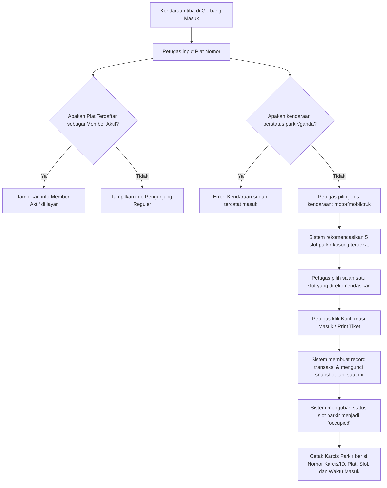

# Alur Kerja (Workflow) Sistem Manajemen Parkir

Dokumen ini menjelaskan alur kerja (workflow) operasional untuk setiap peran (role) pengguna dalam ekosistem **Sistem Manajemen Parkir**.

---

## 1. Peran: Pengunjung Umum (Public / Guest)

Pengunjung umum berinteraksi dengan sistem melalui halaman eksternal (Landing Page publik berbasis React.js) yang terhubung dengan API backend Laravel.

### A. Alur Pengecekan Ketersediaan Slot Parkir (Real-Time Slot Counter)
1. Pengunjung mengakses Landing Page publik sebelum pergi ke lokasi parkir.
2. Halaman publik melakukan request ke endpoint API `GET /api/available-slots`.
3. Sistem menghitung secara real-time dari tabel `parking_slots` jumlah slot yang berstatus `available` per jenis kendaraan (`motor`, `mobil`, `truk`).
4. Pengunjung melihat visualisasi jumlah slot kosong di layar (contoh: "Mobil: 5/10 Tersedia").

### B. Alur Pengecekan Informasi Tarif Parkir
1. Pengunjung menelusuri bagian informasi tarif pada Landing Page.
2. Halaman publik melakukan request ke endpoint API `GET /api/rates`.
3. Pengunjung dapat melihat tarif jam pertama, tarif jam berikutnya, batas tarif harian maksimal, serta denda karcis hilang secara transparan.

### C. Alur Registrasi Member Langganan
1. Pengunjung masuk ke formulir pendaftaran member di Landing Page.
2. Pengunjung memasukkan nama lengkap, nomor plat kendaraan, jenis kendaraan (`motor`/`mobil`/`truk`), dan nomor telepon/WhatsApp.
3. Halaman mengirimkan data melalui request `POST /api/members`.
4. Sistem memvalidasi keunikan plat nomor (tidak boleh terdaftar ganda) lalu menyimpan data ke tabel `members` dengan status awal `pending`.
5. Pengunjung melihat pesan pemberitahuan untuk melanjutkan proses pembayaran dan aktivasi fisik ke kantor administrasi pengelola parkir (Admin).

---

## 2. Peran: Petugas Gerbang (Staff / Operator POS)

Petugas gerbang masuk dan keluar menggunakan antarmuka internal POS (Point of Sale) yang dibangun menggunakan Livewire 4. Petugas harus login terlebih dahulu.

### A. Alur Gerbang Masuk (Entry Gate POS)
*Komponen Utama*: [EntryGate.php](file:///d:/sistem-manajemen-parkir/app/Livewire/EntryGate.php) | [entry-gate.blade.php](file:///d:/sistem-manajemen-parkir/resources/views/livewire/entry-gate.blade.php)

1. **Input Data**: Petugas memasukkan nomor plat kendaraan. Sistem secara otomatis mendeteksi status member aktif dengan mencocokkan plat nomor ke tabel `members` (jika aktif, detail member akan langsung ditampilkan).
2. **Validasi Ganda**: Sistem memverifikasi apakah kendaraan dengan plat tersebut sudah terdaftar sedang parkir di dalam area.
3. **Pemilihan Slot**: Petugas memilih jenis kendaraan. Sistem secara reaktif memuat 5 slot kosong pertama dari database untuk direkomendasikan kepada pengendara.
4. **Finalisasi**: Petugas memilih kode slot dan menekan tombol **"Confirm Entry"**. Sistem menyimpan data ke tabel `parking_transactions` dengan status `parked`, merekam snapshot tarif aktif, memperbarui status slot menjadi `occupied`, dan memunculkan pop-up karcis berisi kode batang/karcis ID untuk dicetak dan diberikan ke pengendara.

---

### B. Alur Gerbang Keluar - Kasus Normal (Exit Gate POS)
*Komponen Utama*: [ExitGate.php](file:///d:/sistem-manajemen-parkir/app/Livewire/ExitGate.php) | [exit-gate.blade.php](file:///d:/sistem-manajemen-parkir/resources/views/livewire/exit-gate.blade.php)

1. **Penyerahan Karcis**: Pengendara tiba di gerbang keluar dan menyerahkan karcis parkir ke petugas.
2. **Pencarian Data**: Petugas mencari transaksi berdasarkan Nomor Karcis (ID Transaksi) atau Plat Nomor kendaraan melalui input pencarian di POS Keluar.
3. **Kalkulasi Biaya Otomatis**:
   - Sistem mengambil data waktu masuk dan mencocokkannya dengan waktu keluar saat ini.
   - Durasi dihitung dalam menit, lalu dibulatkan ke atas menjadi jam.
   - Tarif dihitung menggunakan **Snapshot Tarif** yang tersimpan pada transaksi terkait (mencegah kesalahan perhitungan jika ada pergantian tarif sistem di tengah masa parkir).
   - Perhitungan: `first_hour_rate + (subsequent_hours * subsequent_hour_rate)`. Jika total melebihi `daily_max_rate` (dan nilai max rate tidak null), total biaya diturunkan ke batas maksimal harian tersebut.
4. **Verifikasi & Input Pembayaran**: Petugas mengonfirmasi jenis kendaraan, plat nomor, dan total biaya kepada pengendara. Petugas memilih metode pembayaran (Cash / E-Wallet / Debit).
5. **Finalisasi Keluar**: Petugas mengklik tombol **"Proses Keluar"**. Sistem memperbarui transaksi dengan status `exited`, mencatat waktu keluar, jumlah biaya (`fee`), dan metode pembayaran, serta mengubah status slot parkir yang ditinggalkan kembali menjadi `available`.
6. **Cetak Struk**: Pop-up struk pembayaran muncul di layar untuk dicetak dan diberikan kepada pengendara.

---

### C. Alur Gerbang Keluar - Kasus Karcis Hilang (Lost Ticket)
*Komponen Utama*: [ExitGate.php](file:///d:/sistem-manajemen-parkir/app/Livewire/ExitGate.php) (Fungsi `findByPlateForLostTicket`)

1. **Pelaporan Karcis Hilang**: Pengendara melapor ke petugas gerbang bahwa karcis parkirnya hilang.
2. **Pencarian Plat Nomor**: Petugas mengklik tombol **"Karcis Hilang"** di POS Keluar untuk memunculkan modal pencarian. Petugas mencari transaksi aktif berdasarkan Plat Nomor kendaraan.
3. **Pemberlakuan Denda**:
   - Setelah transaksi ditemukan, petugas mengonfirmasi data kendaraan fisik dengan data transaksi di layar.
   - Sistem secara otomatis menandai transaksi tersebut sebagai **"Lost Ticket"** (`isLostTicket = true`).
   - Sistem menambahkan denda karcis hilang (`snapshot_fine_lost_ticket` dari transaksi) ke dalam kalkulasi biaya parkir normal.
4. **Pembayaran & Finalisasi**: Pengendara membayar biaya parkir reguler + biaya denda karcis hilang. Petugas memilih metode pembayaran dan memproses transaksi keluar.
5. **Pelepasan Slot**: Status transaksi diperbarui menjadi `exited`, slot parkir kembali berstatus `available`, dan struk khusus yang mencantumkan rincian denda dicetak untuk pengendara.

---

## 3. Peran: Admin / Manajer

Admin/Manajer memiliki akses penuh ke seluruh sistem aplikasi internal untuk mengawasi operasional harian dan melakukan konfigurasi bisnis.

### A. Alur Monitoring & Analitik Harian
*Komponen Utama*: [AdminDashboard.php](file:///d:/sistem-manajemen-parkir/app/Livewire/AdminDashboard.php)
1. Admin mengakses menu **Dashboard**.
2. Dashboard menampilkan ringkasan data real-time:
   - **Total Pendapatan Hari Ini**: Total uang yang berhasil dikumpulkan dari transaksi berstatus `exited` pada hari ini.
   - **Kendaraan Parkir Aktif**: Jumlah kendaraan yang saat ini masih berada di dalam area parkir (`status = parked`).
   - **Tingkat Okupansi Slot (%)**: Persentase slot terisi dibanding total slot parkir keseluruhan.
   - **Grafik Tren Kendaraan Masuk**: Grafik garis/batang yang menunjukkan frekuensi kendaraan masuk setiap jam pada hari ini (00:00 - 23:00) untuk menganalisis jam sibuk.
3. Dashboard diperbarui otomatis setiap 60 detik menggunakan mekanisme `wire:poll`.

### B. Alur Manajemen & Override Slot Parkir (Allotment Map)
*Komponen Utama*: [AllotmentMap.php](file:///d:/sistem-manajemen-parkir/app/Livewire/AllotmentMap.php)
1. Admin mengakses menu **Peta Slot (Allotment Map)**.
2. Sistem menyajikan grid peta visual seluruh slot parkir. Setiap kotak slot diberi warna berdasarkan statusnya:
   - **Hijau**: Tersedia (`available`).
   - **Merah**: Terisi (`occupied`).
   - **Kuning**: Dipesan (`reserved`).
   - **Abu-abu**: Rusak/Dinonaktifkan (`disabled`).
3. **Detail Parkir Aktif**: Jika Admin mengklik slot berwarna merah (`occupied`), modal detail akan menampilkan nomor plat kendaraan, waktu masuk, dan total durasi parkir sejauh ini.
4. **Override Manual**: Admin dapat mengubah status slot tertentu secara paksa (misal mengubah slot kosong menjadi `reserved` untuk tamu VIP, atau `disabled` karena ada perbaikan semen jalan). Fitur override ini **dicatat ke dalam log sistem** demi keamanan (`Log::info`).

### C. Alur Verifikasi & Aktivasi Member Langganan
*Komponen Utama*: [MemberManagement.php](file:///d:/sistem-manajemen-parkir/app/Livewire/MemberManagement.php)
1. Pengunjung yang sudah melakukan pendaftaran online menemui Admin untuk melakukan pembayaran langganan secara fisik.
2. Admin mengakses menu **Manajemen Member** dan memilih tab **Pending**.
3. Admin mencari nama calon member atau plat nomor yang sesuai.
4. **Aktivasi**: Admin mengklik tombol **"Aktifkan"** pada baris member. Sistem menetapkan waktu mulai langganan (`subscription_start`) hari ini, dan masa berakhir (`subscription_end`) 30 hari ke depan, serta mengubah status member menjadi `active`.
5. **Manajemen Akun Member**: Admin juga dapat memperpanjang masa aktif member, menonaktifkan member yang melanggar aturan (`expired`), menghapus member dari database, serta melihat riwayat transaksi parkir member tersebut di masa lalu.

### D. Alur Konfigurasi Tarif Parkir (Dynamic Rates)
*Komponen Utama*: [RateManagement.php](file:///d:/sistem-manajemen-parkir/app/Livewire/RateManagement.php)
1. Admin mengakses menu **Payments & Rates**.
2. Menu ini menyajikan daftar tarif aktif untuk motor, mobil, dan truk.
3. **Ubah Tarif**: Admin mengklik tombol **"Edit"** pada salah satu jenis kendaraan, lalu memasukkan tarif baru (tarif jam pertama, tarif per jam berikutnya, batas maksimal harian, denda karcis hilang).
4. **Log Perubahan**: Ketika tarif disimpan, sistem memperbarui tabel `parking_rates` dan secara otomatis mencatat riwayat tarif lama dan tarif baru ke dalam tabel `rate_change_logs` lengkap dengan nama admin yang mengubahnya.
5. Tarif baru ini hanya berlaku untuk kendaraan yang masuk *setelah* waktu penyimpanan tarif, sedangkan kendaraan yang sedang parkir tetap menggunakan tarif lama berkat mekanisme snapshot transaksi.

### E. Alur Manajemen Karyawan (User Management)
*Komponen Utama*: [UserManagement.php](file:///d:/sistem-manajemen-parkir/app/Livewire/UserManagement.php)
1. Admin mengakses menu **Manajemen Karyawan**.
2. **Tambah Petugas**: Admin dapat mendaftarkan akun karyawan baru dengan menentukan nama, email, password, dan level hak akses (`admin` atau `staff`).
3. **Modifikasi / Hapus**: Admin dapat mengganti password karyawan jika lupa, memperbarui data profil karyawan, dan menghapus akun petugas gerbang yang sudah tidak bekerja lagi. Sistem mencegah admin menghapus akunnya sendiri yang sedang aktif digunakan.

### F. Alur Rekapitulasi & Pelaporan Pendapatan
*Komponen Utama*: [ReportPage.php](file:///d:/sistem-manajemen-parkir/app/Livewire/ReportPage.php) | [ReportExportController.php](file:///d:/sistem-manajemen-parkir/app/Http/Controllers/ReportExportController.php)
1. Admin mengakses menu **Laporan**.
2. Admin memilih tipe filter periode laporan:
   - **Harian**: Memilih tanggal spesifik.
   - **Mingguan**: Memilih tanggal akhir minggu (sistem merekap 7 hari ke belakang).
   - **Bulanan**: Memilih bulan dan tahun tertentu.
3. Admin mengklik tombol **"Tampilkan Laporan"**. Sistem memuat seluruh transaksi berstatus `exited` dalam rentang tanggal tersebut, menghitung total pendapatan bersih, total denda tiket hilang, total unit transaksi, serta menampilkan daftar transaksi dalam bentuk tabel.
4. **Ekspor Data**: Admin dapat mengklik tombol **"Ekspor Excel"** atau **"Ekspor PDF"** untuk mengunduh rekap laporan untuk keperluan laporan ke jajaran direksi/keuangan.
